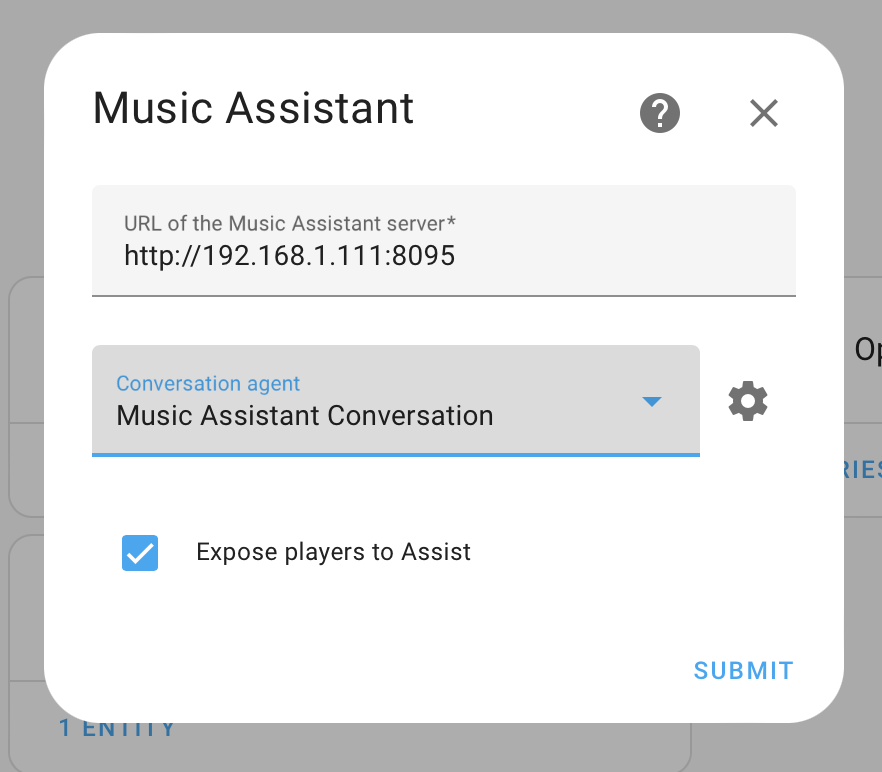

# Music Assistant Integration

## Attention: Running Home Assistant 2023.3 or later?
Make sure to install at least the 2023.6.bx BETA version of the Music Assistant HA Integration. Older versions of the Integration are not compatible with recent Home Assistant versions. Music Assistant HA Integration version [2023.12.0](https://github.com/music-assistant/hass-music-assistant/releases/tag/2023.12.0) was released on Dec. 29 and should be used in the first instance. The subsequent beta versions introduce the voice control functionality.

## Installation of the Home Assistant Integration

- Make sure that you have the [Home Assistant Community Store](https://hacs.xyz/) installed.
- Within HACS, search for `Music Assistant` and click the entry in the search results.
- Click the big (blue) button at the bottom for `Download`.
- Click the button again and in the dialog make sure `Show beta versions` is selected if you want to use those versions.
- Download the desired version
- Restart Home Assistant.
- Go to Configuration -> Integrations and click the big `+` button.
- Look for Music Assistant and click to add it.
- If Music Assistant does not show, refresh your browser (cache).
- The Music Assistant integration is ready for use.
- The MA server addon will be installed automatically.

!!! note
    You need to set-up the players and music sources within Music Assistant itself.

!!! note 
    The HA integration will create new media_player entities for those player types which are supported natively by MA. To see the names of those players go to `settings > devices & services > integrations > music assistant`. It is these players that need to be targeted in your automations.

## OpenAI features

During [Chapter 5 of "Year of the Voice"](https://www.youtube.com/live/djEkgoS5dDQ?si=pt8-qYH3PTpsnOq9&t=3699), [JLo](https://blog.jlpouffier.fr/chatgpt-powered-music-search-engine-on-a-local-voice-assistant/) showed something he had been working on to use the OpenAI integration along with Music Assistant. Note that this originally worked by using custom intents and it was difficult to reliably specify a player or an area for the music to be sent to. For this reason the functionality is built into the MA Integration.

**Installation Requirements**

- You need to be running the latest BETA of the HA Integration
- You need a voice assistant configured (even if you want to just type in the query)
- You need to create/add another OpenAI integration that is purely for Music Assistant.
Add the prompt found [here](https://github.com/music-assistant/hass-music-assistant/blob/main/prompt/prompt.txt) when completing the configuration. For the ChatGPT version `gpt-3.5-turbo-1106` has been found to work well.
- Add a directory to your Home Assistant `config` directory named `custom_sentences/en`
- Add the file found [here](https://github.com/music-assistant/hass-music-assistant/blob/main/custom_sentences/en/play_media_on_media_player.yaml), to that directory.
- When setting up the Music Assistant integration, make sure that you select the correct Conversation Agent and also allow the auto-exposure of MA media players to Assist

**Usage**

!!! note
    This functionality has only been tested with `Home Assistant` selected as the `Conversation Agent` in the voice assistant configuration.

The command to play must follow a certain format. For the following examples assume the house has three areas called `Study`, `Kitchen `and `Karen's Bedroom` and there are three media players with friendly names "`Study Sonos`", "`Google Home`" and "`Karen's Speaker`". Assist aliases are supported for areas and entities.

There are two main formats which differ by where the playing location appears in the sentence. 
`Play Nirvana in the Study` or `Listen to Nirvana in the Study`
`In the Study play Nirvana` or `In the Study listen to Nirvana`

You can do exactly the same as the above but use the friendly names or any assist aliases of the media player instead of the area name:
`Play Nirvana on the Google Home`
`Play the Dixie Chicks First Album on Karen's Speaker`

If you have more that one media player in an area you can also use:
`Play Nirvana in the Study on the Study Sonos`

Other examples that work are (this is not an exhaustive list):
`Play Beds are burning by Midnight Oil on the Google Home in the Kitchen`
`Play Journey Don’t stop believing in the Study on the media player`
`In the Study on the speaker listen to Journey Don’t Stop Believing`

**Troubleshooting**

- If when trying to play to a specific player using the friendly name you receive “An unexpected error occurred while handling the intent” try adding an alias to the MA media player entity (which can be identical to the friendly name).
- If you have failures playing to an area with an error in the log related to `No entities matched` then make sure you don't have any entities named identically to your area
- Ensure media players and areas are exposed to Assist

## I need help, I have feedback

- [issue tracker](https://github.com/music-assistant/hass-music-assistant/issues) to create bug reports, please include detailed info and logfiles. Please check if your issue has already been reported.
- [feature requests](https://github.com/music-assistant/hass-music-assistant/discussions/categories/feature-requests-and-ideas): Give your vote to an existing request, join the discussion or add a new request.
- [Q&A section](https://github.com/music-assistant/hass-music-assistant/discussions/categories/q-a-faq) Frequently asked questions and tutorials
- [discord community](https://discord.gg/kaVm8hGpne) Join the community and get support!
