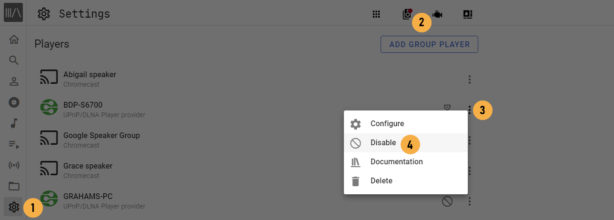
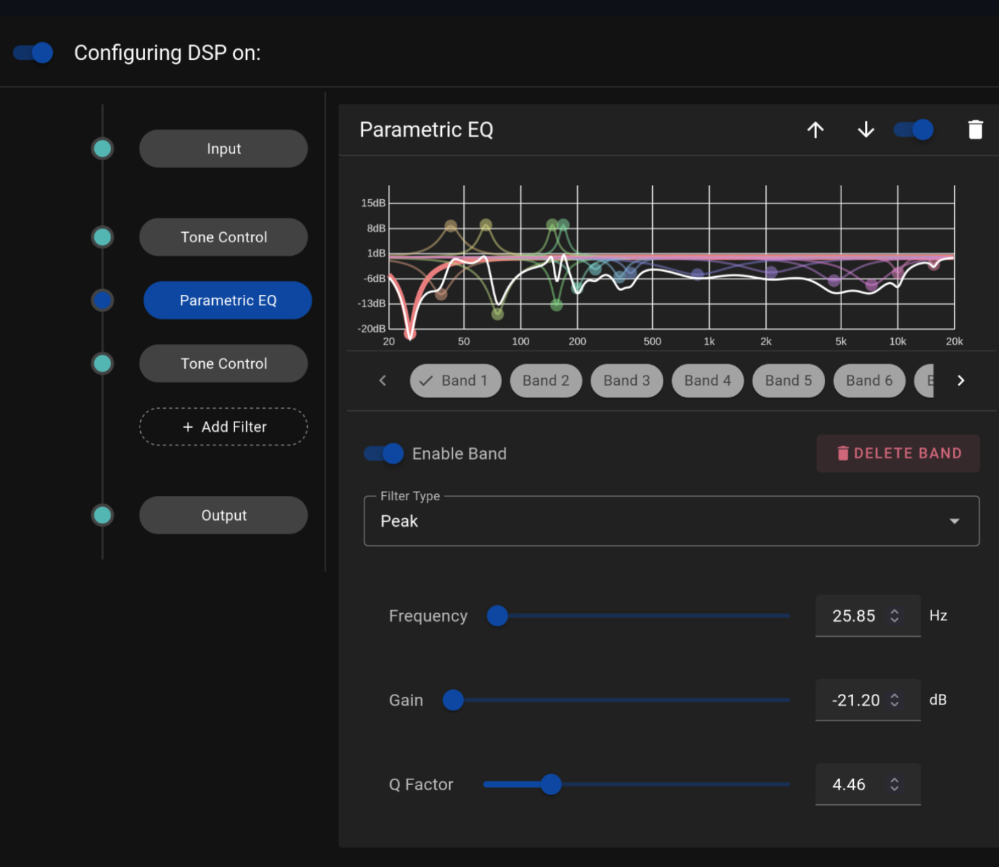

# Player Providers

For specific player provider information refer to the relevant section in this document. When a player provider is enabled then the devices which support that protocol will be automatically discovered by Music Assistant. The following table summarises player capabilities. Note that DLNA and HA players can suffer from poor implementation of required standards. If these player types do not work well and the device supports other protocols then use the other protocol.

{ width = 600 }

If a device supports multiple protocols then multiple players for the device will be seen. In the player provider settings you can disable or hide any players you do not use. 

Players can only deleted if they are unavailable or disabled. Deleting a player can be useful if there is a problem with it. Deleted players which become or are still available will get rediscovered and will return to the list on MA restart or player provider reload.

{ width = 600 } 

!!! note
    If any player is not transitioning between songs then check if the player has the option QUEUE FLOW MODE. Try enabling it if it does.

## Audio Quality

Audio quality is the principal reason why native MA players are developed. These players provide the highest quality playback experience. HA players should work and may work well but they may also have been written with a basic objective such as enabling text to speech. Therefore, if there is a MA player available and a HA integration then you should always choose the MA player. 

A sample rate above 48kHz or a bit depth above 16 is considered High Resolution (Hi Res)

## DSP Settings

All providers, except Snapcast, have the option to apply [Digital Signal Processing](https://en.wikipedia.org/wiki/Digital_signal_processing) (DSP) filters to the audio stream. The option is found in the MA settings for each player.

The DSP path has mandatory INPUT and OUTPUT filters and optionally the following can also be added:

- Parametric Equalizer
- Tone Controls

The DSP settings can be enabled and disabled via a toggle which allows easy [A-B testing](https://www.youtube.com/watch?v=KefGjPYyIO4)

The line on the left of the DSP settings represents the audio path from the audio file (top) to the speaker (bottom).

A dot on the line represents a filter that changes the signal. The lack of a dot indicates that the particular filter has been disabled.

