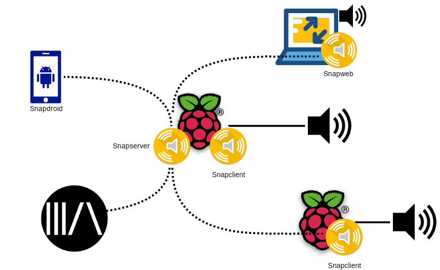

# Snapcast { width=70 align=right }

Music Assistant supports Snapcast, a powerful solution for synchronized multi-room audio streaming. Snapcast enables seamless playback across various devices, creating an immersive audio experience.
Whether you're using Snapcast-compatible speakers or devices like the Raspberry Pi, you can enjoy synchronized audio playback effortlessly. This component is contributed and maintained by [SantiagoSotoC](https://github.com/Santiagosotoc).

MA includes a built-in Snapserver although an external server can also be used. The diagram below shows a possible combination of outputs. In the diagram a Raspberry Pi runs the server which communicates to MA and all of the clients. The server running Pi is also running Snapclient and is connected to a set of speakers. Then there is another Pi running Snapclient in another room, a phone running Snapdroid and a laptop running Snapweb.

{ width=800 }

## Features

- Synchronized playback across all Snapcast devices
- Lossless audio quality with options for 48 kHz /16bits PCM

## Known Issues / Notes

- The Snapcast provider will use the built-in Snapserver by default although a switch in the settings allows the use of an external server if desired. When using an external server the server IP and port must be entered
- Music Assistant only supports external Snapcast servers running version 0.27.0 (or newer). If using an external server you can confirm the version by launching with the command `snapserver -v`. Note that version 0.28.0 is only supported on a 64 bit OS
- If not using an external server then the built-in Snapserver with the Snapweb option will be launched when this provider is added. Once enabled the workings of the server are transparent and the clients appear in the MA UI
- Clients are created by pointing a browser or Snapdroid at `<YOUR_MA_IP_ADDRESS>:1780`. The browser tab must remain open to maintain the stream
- Client names for all clients can be adjusted in Snapweb and Snapdroid via their respective UIs. Additionally, it is possible to rename the players in the MA settings
- The built-in Snapserver can only accept connections from Music Assistant
- If it is necessary to adjust the latency of a client, it must be done from another interface such as Snapdroid or Snapweb
- If muted players go out of sync or exhibit undesirable rebuffer delays when subsequently unmuted, or shutdown while muted then try turning on the option `Send audio to muted clients`
- Pausing has been implemented as best as can be achieved with the limitations of Snapcast. MA issues a STOP and RESUME command to achieve the pause effect but this means the resulting player state never changes to paused.
- Occasionally after a stream change (pause, skip or seek) Snapweb can go silent. This can be fixed by selecting stop then play in the Snapweb UI
- The Snapcast app for iOS is broken as it uses an old version of Snapclient. Using it brings problems with this provider
- Ensure that the ports 1704 and 1705 on the Snapserver host are open. Also make sure that the ports between 4953 and 5153 inclusive are open
- Try the default Snapcast settings and then make changes as necessary
- Very short announcements may not play correctly
