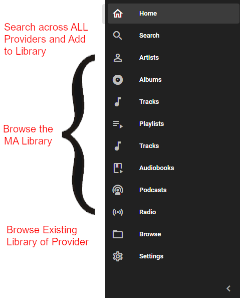
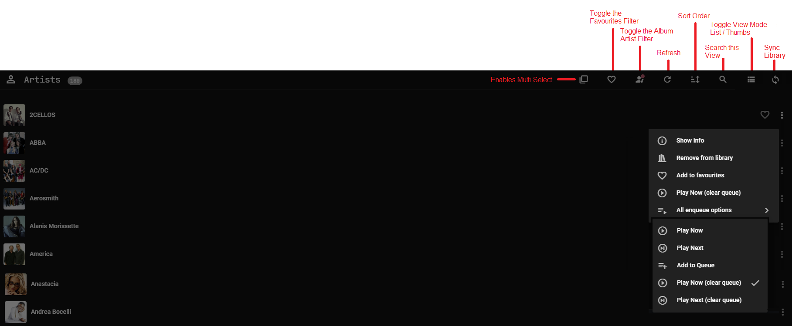

# User Interface

When visiting Browse you will only see what is already in the Library of the Streaming Providers. For the local Providers you will see all files and if a folder is visited that is not already in the MA Library it will be automatically added even if it has been previously removed.
***************************************************************

The codec shown in the UI to the right of the track title is the codec of the original source. MA re-encodes the track to FLAC when it is sent to the player. 

!!! note
    The volume shown against a player group is the AVERAGE of the volumes of each individal player. When the group volume is changed then each player is changed by a proportionate amount.
***************************************************************

## Artist / Album / Track View

Album and Track Views look the same as the above except there is no album artist filter icon but there is an additional view specific menu item

A red dot on the search icon indicates that the viewed results are subject to filtering by search. This is useful if the search box has been closed.

Items in all views can be "right clicked" or "long pressed" to bring up an extensive menu of options. See an example below in the [Track Menu](ui.md#track-menu) section

Multiple selections of albums / artists / tracks is possible by clicking the multi-select icon. Once one or more items are selected then clicking on the "ACTIONS" at the bottom

will bring up this menu

The behaviour described above will work on any view where you see the "x item(s) selected" text.

***************************************************************

## Individual Artist View

The tracks and albums section are collapsible. The view above shows them both collapsed. The tracks section shows ALL tracks. To see what albums any given track is on you can either sort alphabetically or click on one and use the context menu and SHOW INFO. 

The PROVIDER DETAILS section shows from where the albums and tracks listed above were obtained. It is normal to have multiple entries here if an artist has aliases or there are variant spellings, use of punctuation etc.  The ID shown against the streaming provider may be used in automations and scripts.

***************************************************************

## Track Menu

Right click or long press on a track to get the following

If the provider supports it you will also see the START RADIO option. This will populate the queue with tracks based on the selected track.

***************************************************************

## Track "Show Info" View

!!! note
    The PROVIDER DETAILS section in this view also has the functionality to play a short part of the track as a preview
