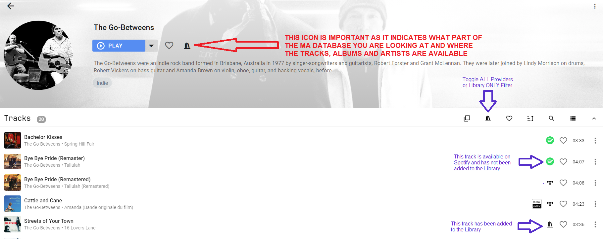
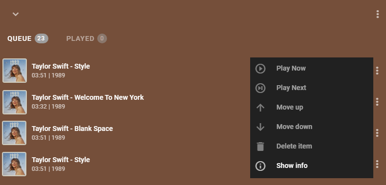

## The Library

The Music Assistant Library is a database containing details of the music which the user has indicated they are interested in listening to on a regular basis. It consists of information about Artists, Albums, Tracks, Playlists and Radio Stations which allows easy searching, display and cross referencing across the User Interface.

For local music providers all artists/albums/tracks/playlists are imported into the MA library when the provider is added and at each sync.

For streaming providers ONLY the SPECIFIC artists/albums/tracks/playlists that are in the streaming providers library (or favourites or however it is termed in the provider) will be imported into the MA library when the provider is added and at each sync. This means, for example, if you have an artist in the providers library but none of their albums then all you will see in the MA library is the artist with NO associated albums or tracks. You have to subsequently add albums or tracks to the MA library if you want to see them in the library views. Note you can toggle the library / streaming provider filter option to see all that is available in the streaming provider.

**Favourites**

As a further means of filtering the library, items can be marked as a "favourite". This is shown in the UI as a filled heart icon. Items are not favourited by default. You can see all items if you deselect the heart icon in the top menu.

## The Queue

Each player has its own queue. Viewing the queue is done by pressing the :material-playlist-play: button. This button can be found on the control bar at the bottom of the UI or for narrow displays in the NOW PLAYING view.

Depending upon screen resolution the PLAYED ITEMS option may or may not be visible. If it is then selecting that will show the previous items from the queue and selecting any will restart the queue from that point.

!!! note
    What happens to the queue when the different types of items (e.g. album, artist, playlist etc) are added to it is configurable in MA SETTINGS>>CORE>>PLAYER QUEUES CONTROLLER
    
Right clicking or long press on a track in the queue will show this menu

The options in the menu in the top right is shown below. This is the only place crossfade can be enabled or disabled (crossfade duration is set in the player settings). Repeat and Shuffle have buttons at the bottom in the control bar (or in the NOW PLAYING view for narrow mobile devices).

!!! note
    If a queue is paused for more than 30 seconds it's status will change to stopped 
    
## Playlists

Playlists must be stored on a provider. A music provider's playlist can only contain tracks from that provider. However, MA has a built-in provider with the ability to create playlists that have tracks from multiple music providers. In this case the playlist will be stored solely within the MA database. These options are automtically presented in the Add to Playlist dialog.

Playlists which consist of tracks from the filesystem provider will be stored in the MA database.

User created playlists from streaming providers will be imported into the MA database and will remain synchronised regardless of whether changes are made from the MA UI or from the streaming providers native applicatons.

Automatically generated playlists from streaming providers may be supported. See the specific provider documentation for further information.

MA automatically generates some dynamic playlists. These playlists will be updated when they are viewed or played.
