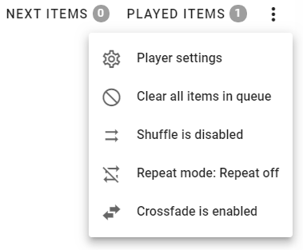

## The Library

The Music Assistant Library is a database containing details of the music which the user has indicated they are interested in listening to on a regular basis. It consists of information about Artists, Albums, Tracks, Playlists and Radio Stations which allows easy searching, display and cross referencing across the User Interface.

For local music providers all artists/albums/tracks/playlists are imported into the MA library when the provider is added and at each sync.

For streaming providers ONLY the SPECIFIC artists/albums/tracks/playlists that are in the streaming providers library (or favourites or however it is termed in the provider) will be imported into the MA library when the provider is added and at each sync. This means, for example, if you have an artist in the providers library but none of their albums then all you will see in the MA library is the artist with NO associated albums or tracks. You have to subsequently add albums or tracks to the MA library if you want to see them in the library views. Note you can toggle the library / streaming provider filter option to see all that is available in the streaming provider.

**Favourites**

As a further means of filtering the library, items can be marked as a "favourite". This is shown in the UI as a filled heart icon. Items are not favourited by default. You can see all items if you deselect the heart icon in the top menu.

## Music Providers

For specific music provider information refer to the relevant section in this document.

General Notes:

- You have to add providers in order to access your music even if the media is visible to HA.
- If you remove a provider a cleanup of the database will be done but it takes a little time to complete. If you restart MA or the provider before the cleanup completes the task will be terminated and will not restart.

## Players

For specific player provider information refer to the relevant section in this document.

**Audio Quality**

96khz/24 bits and above is considered high resolution (Hi Res)

- Sonos annd Airplay support lossless (as in cd quality) but not Hi Res.
- Chromecast supports Hi Res up to 96Khz/24 bits (except the video dongles)
- Slimproto supports Hi Res up to 384khz/24 bits
- DLNA supports Hi Res up to 192/24 bits

**Queue**

Each player has its own queue. Depending upon screen resolution the PLAYED ITEMS option may or may not be visible. If it is then selecting that will show the previous items from the queue and selecting any will restart the queue from that point.

Right clicking or long press on a track in the queue will show this menu

The options in the menu in the top right is shown below. This is the only place crossfade can be enabled or disabled (crossfade duration is set in the player settings). Repeat and Shuffle have buttons at the bottom.

## User Interface

See [here](ui.md)

## Support and Documentation

Because this project originated out of a Home Assistant integration, we maintain all our documentatation and enduser support in a separate reposity. Raise issues and discuss ideas here:
https://github.com/music-assistant/hass-music-assistant

You can also seek help on [Discord](https://discord.gg/kaVm8hGpne)

[repository-badge]: https://img.shields.io/badge/Add%20repository%20to%20my-Home%20Assistant-41BDF5?logo=home-assistant&style=for-the-badge
[repository-url]: https://my.home-assistant.io/redirect/supervisor_add_addon_repository/?repository_url=https%3A%2F%2Fgithub.com%2Fmusic-assistant%2Fhome-assistant-addon
